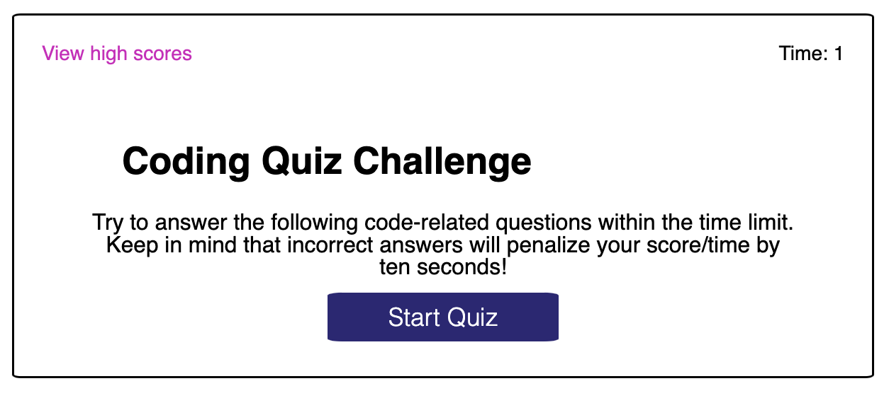
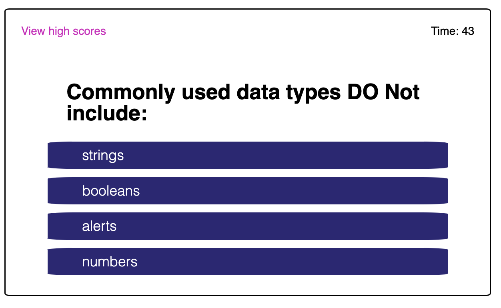
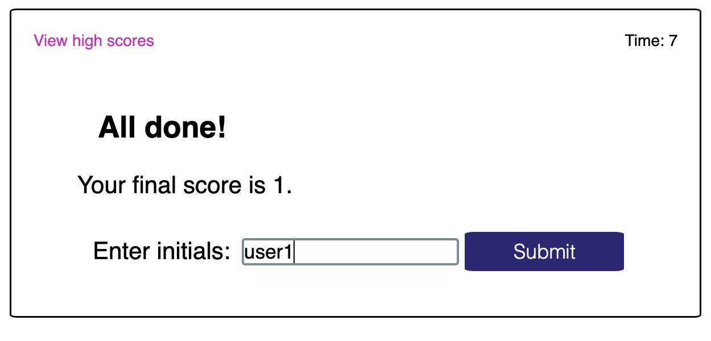
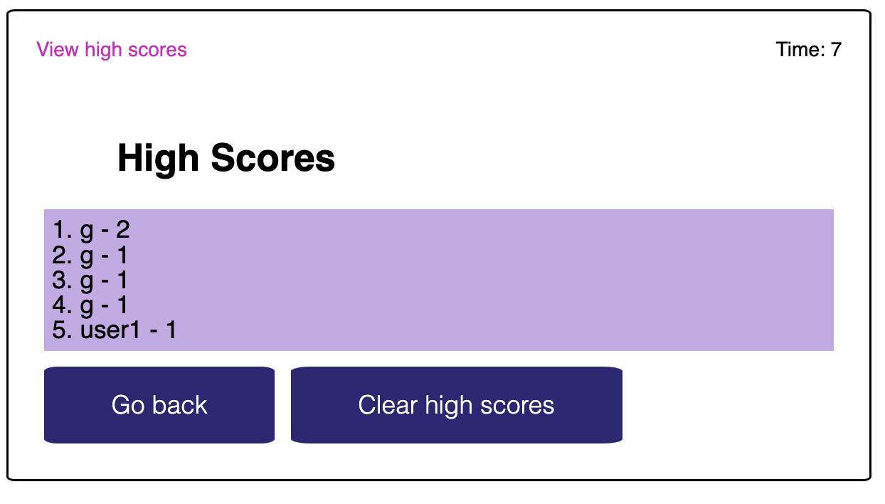

# Coding Quiz

A typical coding assessment is a combination of multiple-choice questions and interactive coding challenges.

## Description

Coding assessment is a timing coding quiz with multiple-choice questions. This appliction runs in the browser and features dynamically updated HTML and CSS powered by JavaScript code.

## Installation

An app is live on Internet and requires to enter and run the following URL from the browser:

https://vasilyl1.github.io/coding-quiz

## Usage

The user clicks the button with the answer, if the answer is incorrect the timer is substracted by ten seconds. Once the answer is clicked, the message correct/wrong displayed and the quiz moves to the next question.

Once the quiz is over, the user can save initials and will see the five best scores displayed on the screen.

At any time during the process, there is an opportunity to click on "view high scores" link. If the link is clicked, the quiz and timer stops and the user is presented up to five of the highest scores, sorted from highest to lowest.

The four screenshots below feature the starting page and the result of the application:

## Credits

N/A

## License

MIT License

Copyright (c) 2022 vasilyl1

Permission is hereby granted, free of charge, to any person obtaining a copy
of this software and associated documentation files (the "Software"), to deal in the Software without restriction, including without limitation the rights to use, copy, modify, merge, publish, distribute, sublicense, and/or sell copies of the Software, and to permit persons to whom the Software is
furnished to do so, subject to the following conditions:

The above copyright notice and this permission notice shall be included in all copies or substantial portions of the Software.

THE SOFTWARE IS PROVIDED "AS IS", WITHOUT WARRANTY OF ANY KIND, EXPRESS OR
IMPLIED, INCLUDING BUT NOT LIMITED TO THE WARRANTIES OF MERCHANTABILITY,
FITNESS FOR A PARTICULAR PURPOSE AND NONINFRINGEMENT. IN NO EVENT SHALL THE
AUTHORS OR COPYRIGHT HOLDERS BE LIABLE FOR ANY CLAIM, DAMAGES OR OTHER
LIABILITY, WHETHER IN AN ACTION OF CONTRACT, TORT OR OTHERWISE, ARISING FROM, OUT OF OR IN CONNECTION WITH THE SOFTWARE OR THE USE OR OTHER DEALINGS IN THE SOFTWARE.